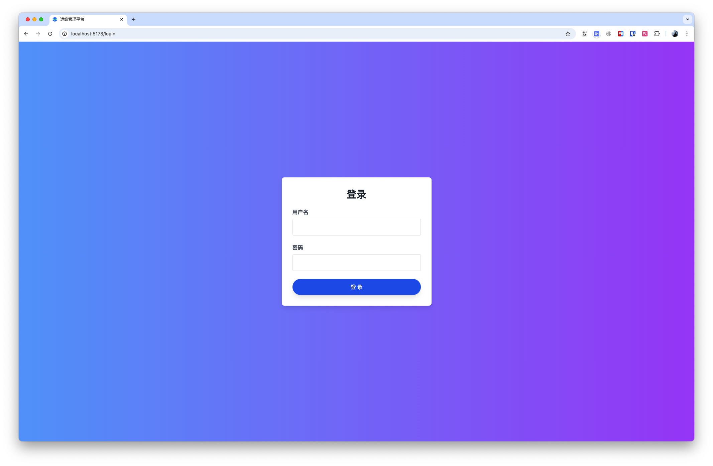
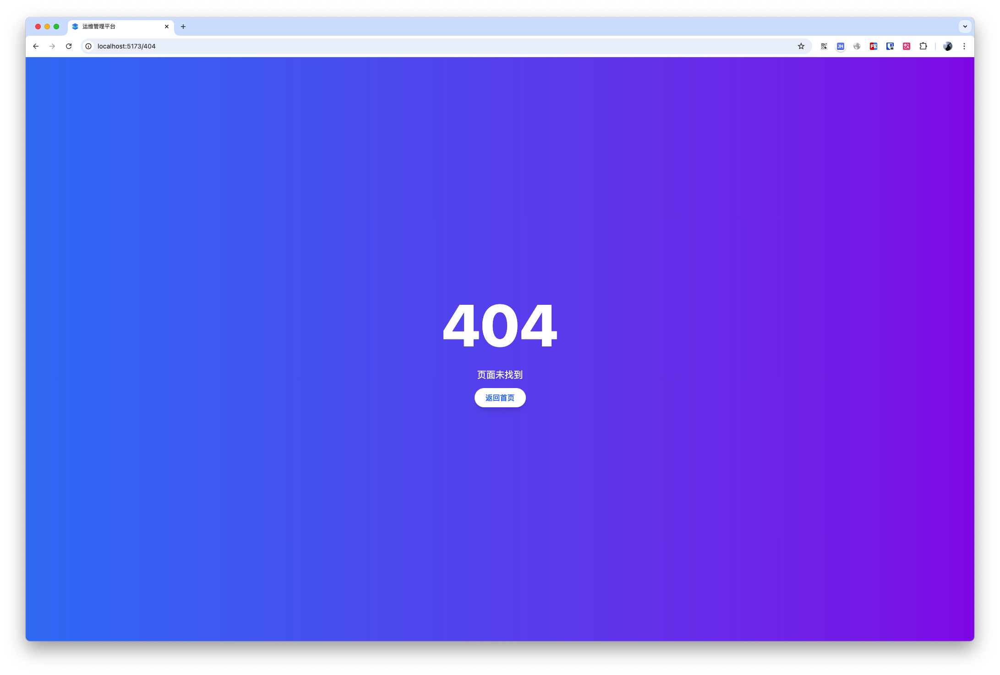
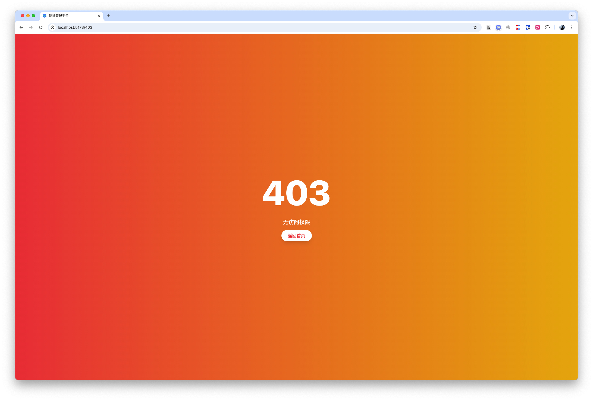
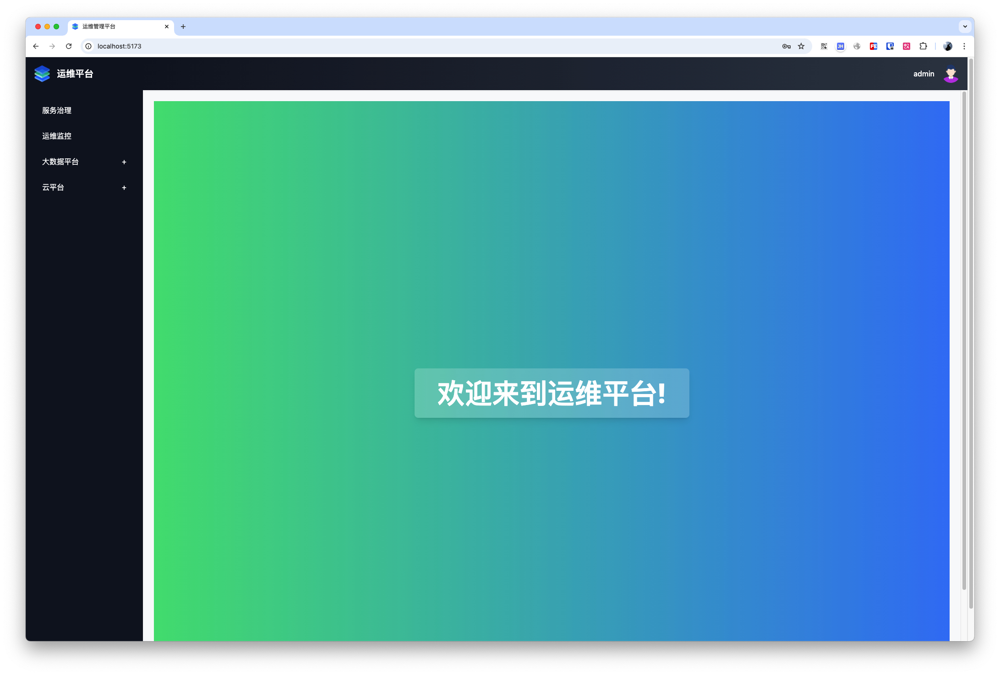
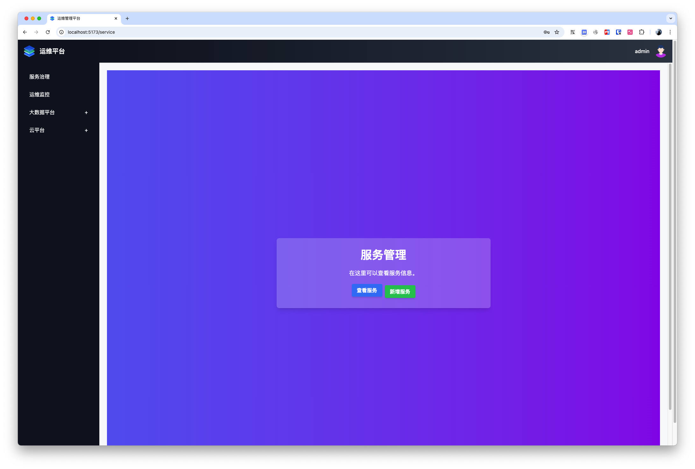
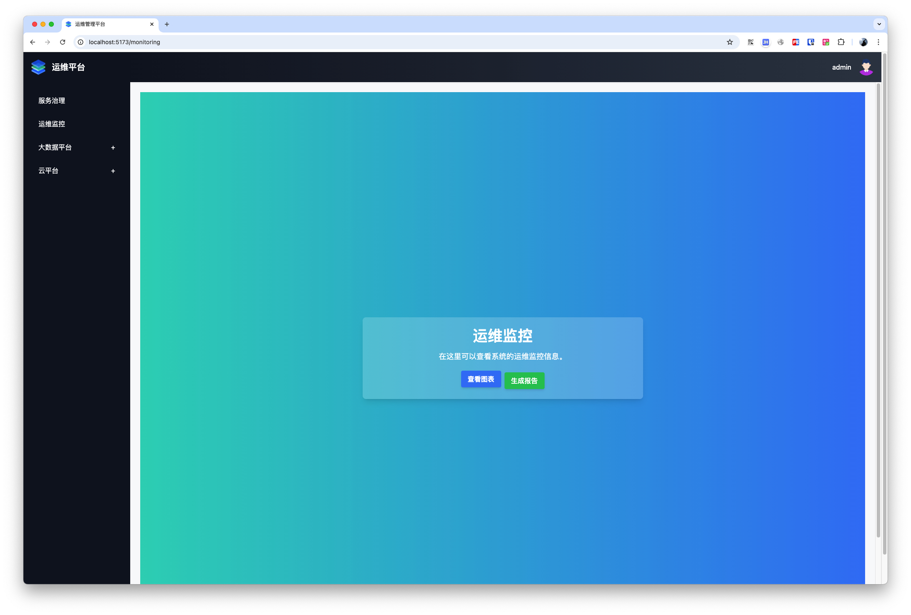
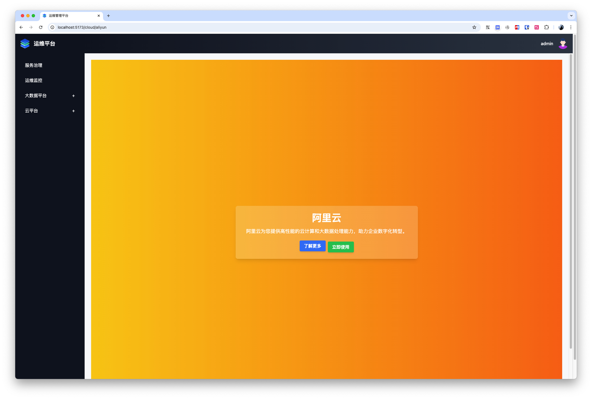

# AI生成前端项目代码 

## 技术栈
Vue3 , Tailwind CSS , TypeScript , Vue Router, Vite , Pnpm 


## AI生成项目代码提示词
```bash
使用 Vue3 , Tailwind CSS , TypeScript , Vue Router, Vite , Pnpm 创建一个运维管理平台系统 ，
主界面如下:
界面布局为侧边栏容器 + 顶栏容器 与 主要区域容器

侧边栏容器，为导航
导航内容，有一级类目与二级类目，左侧导航菜单如下:
1.服务冶理
2.运维监控
3.云平台
3.1.阿里云
3.2.腾讯云
3.3.华为云

内容在  主要区域容器 显示
顶栏容器，最左边是logo图标，最右侧是用户头像与用户名称，点击用户名称下拉出个人信息与退出登录

用户登录页面，用户名 admin 密码 123，还需要一个登录退出
404页面
403页面

综合上面内容 使用 Vite + Pnpm 创建这个项目
然后还要支持移动端手机适配 
注意 script 使用 <script lang="ts" setup> 

```

> AI生成后有一项需要修改兼容有问题，使用 vite@4 版本，使用如下命令创建项目
pnpm create vite@4 ops-platform --template vue-ts

## 环境版本
- node v20.18.1
- pnpm 9.14.4

## 启动项目
`pnpm run dev`

## 访问
- http://localhost:5173/
- admin / 123

## 项目结构及文件介绍
```bash
├── index.html               # 入口 HTML 文件
├── package.json             # 配置项目依赖和脚本
├── pnpm-lock.yaml           # 锁定依赖版本
├── postcss.config.js        # PostCSS 配置文件，用于 Tailwind CSS
├── tailwind.config.js       # Tailwind CSS 配置文件
├── tsconfig.json            # TypeScript 配置文件
├── vite.config.ts           # Vite 配置文件
├── src/                     # 源代码目录
│   ├── assets/              # 静态资源目录（如图片、样式等）
│   │   └── main.css         # Tailwind CSS 主样式文件
│   ├── components/          # 通用组件目录
│   │   ├── Sidebar.vue      # 侧边栏组件
│   │   └── Topbar.vue       # 顶栏组件
│   ├── layouts/             # 布局组件目录
│   │   └── MainLayout.vue   # 主布局组件，包含侧边栏和顶栏
│   ├── router/              # 路由配置目录
│   │   └── index.ts         # 路由配置文件
│   ├── views/               # 各页面视图目录
│   │   ├── Home.vue         # 首页
│   │   ├── Login.vue        # 登录页
│   │   ├── NotFound.vue     # 404 未找到页面
│   │   ├── Forbidden.vue    # 403 禁止访问页面
│   │   ├── Service.vue  # 服务治理页面
│   │   ├── Monitoring.vue  # 运维监控页面
│   │   └── cloud/ # 云平台相关页面目录
│   │       ├── Aliyun.vue   # 阿里云页面
│   │       ├── TencentCloud.vue   # 腾讯云页面
│   │       └── HuaweiCloud.vue   # 华为云页面
│   ├── App.vue              # 根组件，主要用于包含 <router-view />
│   └── main.ts              # 应用入口文件，初始化和挂载根组件
```


## 主要文件和目录介绍
```bash
index.html: 在浏览器中运行的入口 HTML 文件。
package.json: 包含项目信息、依赖和构建脚本。
pnpm-lock.yaml: 锁定依赖版本确保项目一致性。
postcss.config.js: PostCSS 配置文件，用于处理 Tailwind CSS。
tailwind.config.js: Tailwind CSS 配置文件，定义样式规则。
tsconfig.json: TypeScript 配置文件，定义 TypeScript 编译相关选项。
vite.config.ts: Vite 配置文件，用于项目构建和开发服务器设置。
```

## 项目截图






